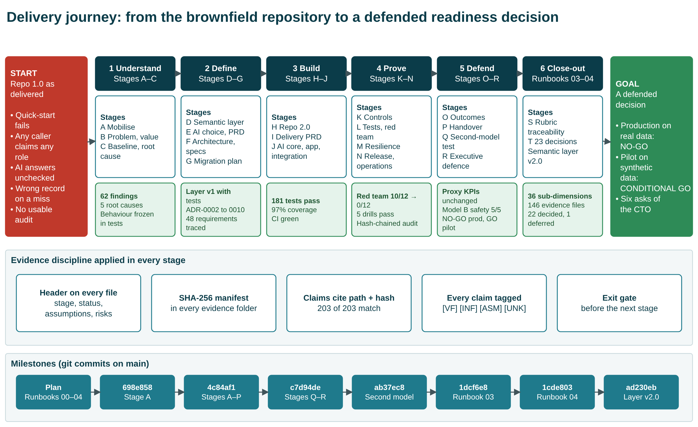
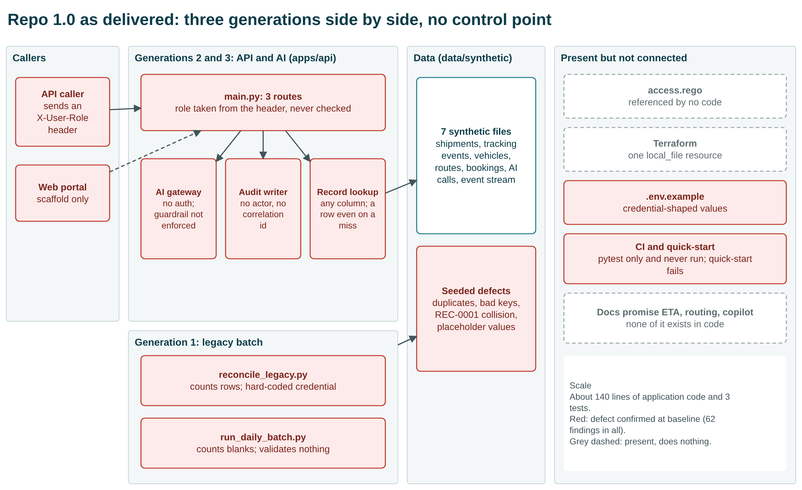
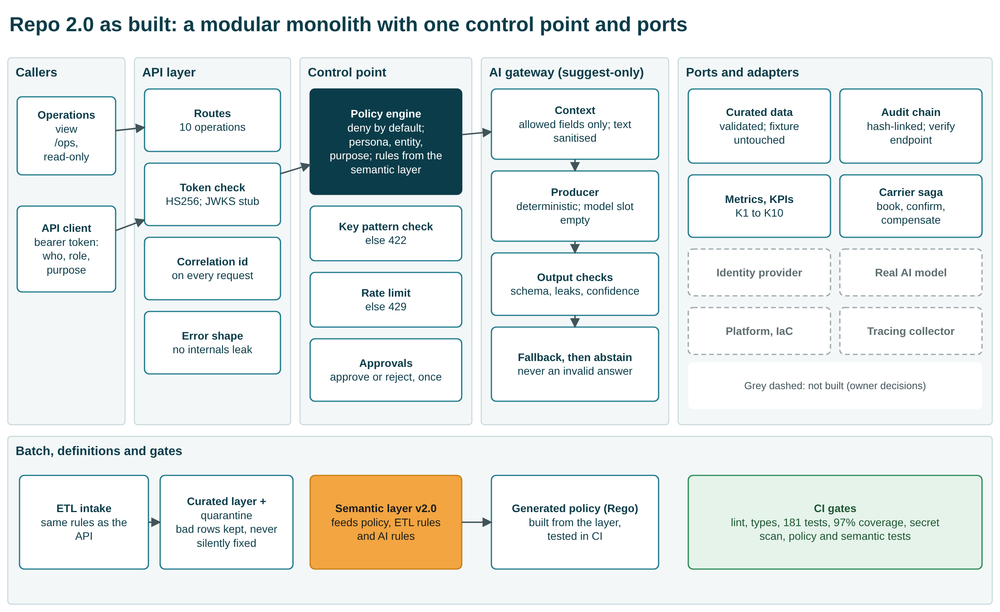
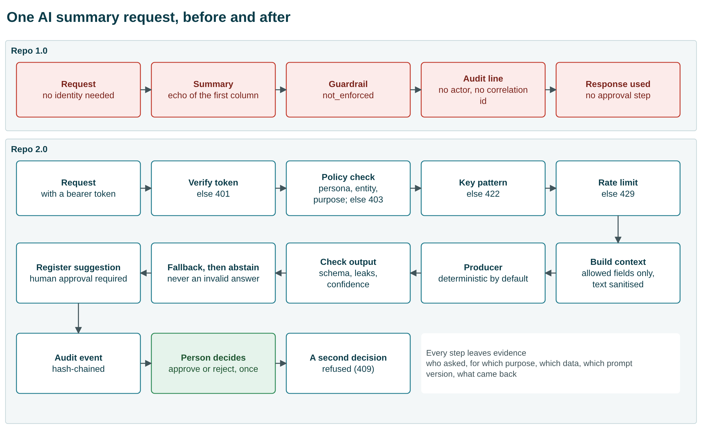
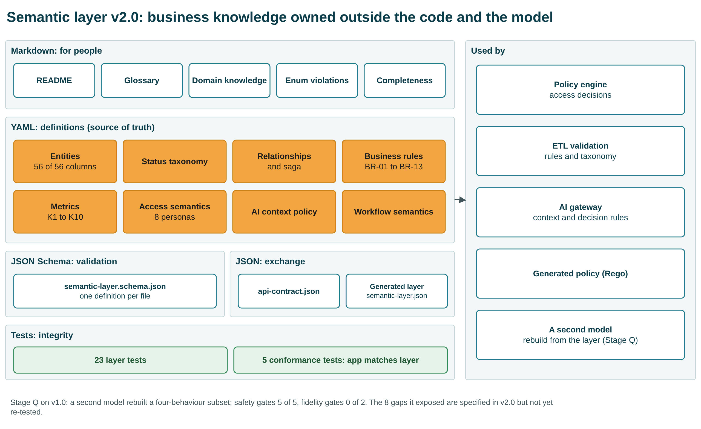
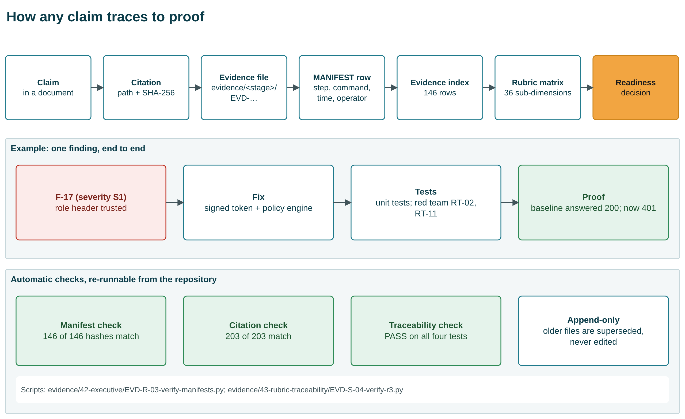

| Field | Value |
|---|---|
| Purpose | One readable account of the whole engagement for the CTO: what we inherited, what we changed, how we proved it, what is still open, and what we need |
| Version | v1.0 |
| Date | 2026-10-08 |
| Author / Agent | Claude Code agent, operator Dinesh |
| Status | Final draft for CTO review |
| Evidence sources | Every figure below is taken from a file in the repository; the evidence register (03-Evidence-Register.xlsx) lists all 146 hashed evidence files |
| Companion files | 02-CTO-Presentation.pptx (slides), 03-Evidence-Register.xlsx (evidence), diagrams/ (editable diagrams) |

Tags used in the source documents: **[VF]** verified fact, **[INF]** inference, **[ASM]** assumption, **[UNK]** unknown.

# 1. The answer in one page

We were handed a logistics operations repository (Repo 1.0) whose own quick-start failed. It let any caller claim any role through a request header, and its AI endpoint answered with no authorisation and no guardrail. A missed lookup returned a different record, and its audit trail could not say who did what.

We froze that behaviour in tests, found and ranked 62 problems, replaced the unsafe paths with tested controls (Repo 2.0), and proved the change:

| Measure | Repo 1.0 | Repo 2.0 |
|---|---|---|
| The same 12 attacks | 10 succeed | **0 succeed** |
| Tests passing | 3 (0 collected without `httpx`) | **181** (plus 7 that pin old behaviour on purpose) |
| Test coverage, application and ETL | 45% | **97%** |
| CI | never run | green on Python 3.11 and 3.14 |
| Evidence | none | **146** hashed files; 203 of 203 document citations verified |

**Decision (recommendation, not an approval):**

- **NO-GO** for production on real data. 5 of 12 readiness gates fail, and closing them needs people and a platform, not more code.
- **CONDITIONAL GO** for a controlled pilot on synthetic data, in a local or test environment.

**Not proven, stated up front:**

- No real AI model was ever called.
- Nothing is deployed.
- No business KPI moved.
- One operator and one agent built, tested and graded everything; there was no independent review.

# 2. The journey from start to goal

The work followed a written runbook of 18 stages (A to R), plus two close-out stages: S, rubric traceability, and T, the 23 open decisions. The stages fall into six phases. Every stage ended at an exit gate before the next began.

Every artifact carries a header block (stage, status, assumptions, risks). Every evidence file is hashed in its folder's manifest, and every claim in a document cites a file path and its hash. The milestone row shows the git commits that recorded each step.

# 3. What we inherited: Repo 1.0

Three engineering generations sat side by side with no control point between caller and data:

- Legacy batch scripts.
- A partly modernised FastAPI service.
- An AI gateway.

Files for policy, Terraform and CI existed but did nothing. The documentation promised ETA prediction, route optimisation and an exception copilot, none of which existed in code. The system was about 140 lines of application code with 3 tests.

## 3.1 Findings and root causes

| Final disposition | Count |
|---|---|
| Fixed | 43 |
| Fixed in the tree (credentials stay in git history) | 4 |
| Partial | 10 |
| Changed by decision | 2 |
| Deferred | 2 |
| Proposed for acceptance | 1 |
| **Total** (25 of them severity S1) | **62** |

Five root causes explain why the defects existed:

- **RC-1 No governance by design:** the old decision to keep legacy code beside the API (ADR-0001) was never revisited. This one is plausible but unconfirmed until an owner is interviewed.
- **RC-2 Identity not modelled.**
- **RC-3 No data contracts.**
- **RC-4 AI unguarded by design.**
- **RC-5 No evidence produced as a by-product.**

The full list of findings is the *Findings* sheet of the evidence register.

# 4. What we built: Repo 2.0

Repo 2.0 is a modular monolith with ports. We chose it over hardening the old monolith or splitting it into services, because the system is too small for network boundaries to pay for themselves. Its main features:

- **One control point.** Every request passes a token check and a deny-by-default policy engine. The engine reads its rules from the semantic layer (persona, entity, purpose, field mask) and generates the Rego policy that CI tests.
- **An AI gateway that only suggests.** It sees allow-listed fields only, checks its own output, and falls back or abstains rather than return an invalid answer. A person must approve or reject every suggestion, once.
- **Validated data.** Data goes through the same validation rules as the API. Bad rows are quarantined, never silently fixed, and the synthetic fixture stays byte-identical.
- **Hash-chained audit.** Every event records actor, correlation id, tenant and the policy decision, and a verify endpoint detects tampering.

Grey dashed boxes in the diagram are not built because they need owner decisions: identity provider, real model, platform and infrastructure, tracing collector.

## 4.1 Repo 1.0 against Repo 2.0

| Area | Repo 1.0 (as delivered) | Repo 2.0 (as built) | Status |
|---|---|---|---|
| Quick-start and tests | Test command fails; 3 tests; 45% coverage | Works; 181 tests; 97% coverage; CI green | Fixed |
| Identity | Role taken from a request header | Signed token, forged tokens rejected; no identity provider yet | Fixed (interim) |
| Authorisation | Flat allow-list; policy file unused | Deny by default; persona, entity, purpose; policy generated and tested; scope narrowing declared but not enforced | Fixed (scope partial) |
| Record lookup | Any column; wrong record on a miss | Key pattern enforced; 404 on a miss; colliding rows quarantined | Fixed |
| AI endpoint | No auth; guardrail off; no schema | Authorised, rate-limited, allow-listed context, checked output, suggest-only | Fixed (no model) |
| Human approval | None | Approve or reject once; self-approval still possible | Fixed (no four-eyes) |
| Audit | Time and action only | Hash-chained; who, purpose, decision; tampering detected; still a local file | Partial |
| Data quality | Defects counted, then discarded | Validated, quarantined, curated layer | Fixed |
| Observability | Notes only | Correlation id, metrics, KPI endpoint; no tracing | Partial |
| CI and change control | Never run | Green on two Python versions; PR template, CODEOWNERS; branch protection not enabled | Partial |
| Secrets | In source and `.env.example` | Removed from the tree; history kept; repository private; values treated as compromised | Fixed in tree |
| Infrastructure | Terraform writes one local file | Container recipe; nothing provisioned; platform-neutral by decision | Deferred |

The workbook's *Repo 1.0 vs 2.0* sheet has all 20 areas, with the findings and evidence file for each. Its *File Inventory* sheet compares the two versions: 51 files and 197 code lines in Repo 1.0, against 158 files and 9,281 code lines in Repo 2.0, counted with git.

# 5. How we proved it

## 5.1 The same 12 attacks, before and after

Ten of twelve attacks succeeded against Repo 1.0; none succeed against Repo 2.0. Two attacks did not succeed even against Repo 1.0: smuggling text through a category field (RT-08), and actioning a suggestion with no approval step, which failed because the route did not exist (RT-10). The *Red Team* sheet of the evidence register lists each attack and the HTTP status it returned. This was our own red team, not an independent one.

## 5.2 One AI request, before and after

## 5.3 Other proof

- 5 failure drills pass:
  - missing correlation ids
  - AI gateway timeout
  - duplicate replay
  - stale master data
  - partial batch failure
- A backup was restored on the synthetic fixture.
- One business event was reconstructed end to end from the audit trail.
- Supply chain: 0 known dependency vulnerabilities, and an SBOM of 21 runtime and 58 development components.
- AI evaluation: 192 cases, 0 failures, on the deterministic provider only.

## 5.4 Business KPIs did not move, and could not

KPIs K1 to K8 are computed from a static synthetic fixture that the intervention does not touch. They are identical before and after, which is the honest and expected result. Only engineering health improved (K9 tests, K10 coverage). No monetary benefit is verified. In the benefit model, which is expressed in analyst-hours, the expected net value at fixture volume is negative.

# 6. The semantic layer and the second-model test

The business meaning of the system is held in portable files, independent of both the code and any AI model:

- Markdown for people.
- YAML definitions: entities, taxonomy, relationships, business rules (BR-01 to BR-13, plus 12 key and pattern rules), 10 metrics, access for 8 personas, AI context policy, workflow semantics.
- A JSON Schema for validation.
- JSON for exchange.
- 28 tests: 23 for the layer itself and 5 that check the application against it.

Version 2.0 was aligned to the capstone requirement (`semantic-layer-build.txt`) after the transformation, as the requirement asks.

To test portability, a second, smaller model of the same vendor family rebuilt part of the system in one blind attempt.

What it was given:

- the semantic layer
- the PRD and the specifications
- a build brief

What it produced:

- **Scope:** a four-behaviour subset of the application.
- **Safety:** it matched the original on the safety behaviours this harness measures: 5 of 5 safety gates passed, and none of the 12 attacks succeeded. That attack result is partly vacuous. With the token used, three AI-path attacks (RT-08, RT-09, RT-12) never reached the AI path, and they passed only in an extra run with an `ai_agent` token that was not pre-registered. It passed 21 of 24 black-box API checks. It also left scope narrowing and tenant filtering unenforced.
- **AI output:** it did not match. Only 8 of 192 evaluation cases passed every strict check, against 192 of 192 for the original. It passed 0 of 2 fidelity gates: abstention scored 0.875 and recommendation class 0.1667, against a required 1.0.

The differences traced to eight places where the specification was silent. Version 2.0 now specifies all eight, but the test has not been repeated. The result is therefore *partly supported*, not a demonstration of model independence.

# 7. How any claim traces to proof

Three scripts re-check the whole chain from the repository:

- **Manifest check:** 146 of 146 hashes match.
- **Citation check:** 203 of 203 citations match.
- **Traceability check:** PASS.

Evidence is append-only: an older file is superseded by a newer one, never edited.

# 8. Rubric evidence coverage

| Criterion | Marks | MET | PARTIAL | NOT MET | BLOCKED | Coverage index |
|---|---|---|---|---|---|---|
| R1 As-Is understanding | 20 | 6 | 1 | 0 | 0 | 0.93 |
| R2 Repo 2.0 design | 25 | 5 | 4 | 0 | 0 | 0.78 |
| R3 Governance, risk, security | 20 | 5 | 2 | 1 | 1 | 0.67 |
| R4 PRD and working application | 25 | 4 | 1 | 0 | 1 | 0.75 |
| R5 Presentation and defence | 10 | 4 | 1 | 0 | 0 | 0.90 |

The index measures how complete the evidence is, not how many marks an evaluator will give. In our judgement [INF], R3 and R4 are held back by missing people and a missing model, not by missing work.

# 9. Readiness decision

| Gate | Criterion | State |
|---|---|---|
| G1 | Tests pass, coverage at or above floor | PASS |
| G2 | Evaluation at thresholds | PASS (deterministic provider only) |
| G3 | No original defect re-exploitable | PASS |
| G4 | No critical or high dependency vulnerability | PASS |
| G5 | Audit tamper-evident; reconstruction shown | PASS (author-run) |
| G6 | Backup restore shown | PASS (repository level) |
| G7 | Rollback defined and rehearsed | PARTIAL |
| G8 | Alerts routed to named people | FAIL |
| G9 | Named approver and risk owners | FAIL |
| G10 | Platform and identity provider exist | FAIL |
| G11 | Independent evidence review | FAIL |
| G12 | Compliance resolved for real data | FAIL |

A pilot needs G1 to G7; production needs all twelve. The gates were fixed before the decision was made. G7 is only partial: rollback is defined, but there is no cutover to rehearse. Even the pilot recommendation therefore rests on conditions.

**Conditions for the pilot** (from the readiness decision):

1. A sponsor accepts that the operator fills every role.
2. The repository visibility is decided and the credentials in history are revoked or confirmed fake. The repository is now private and the values are treated as compromised.
3. Branch protection and required CI checks are turned on. This cannot be done today: GitHub requires a paid plan for branch protection on a private repository.
4. No real personal data and no hosted model are used until the regulatory scope and model questions are closed.
5. One independent reviewer reads this pack.

All 23 open questions now have a dated decision from the operator (15 decided, 7 ratified, 1 deferred). Because one person holds every role, those decisions are provisional. No risk acceptance is signed by a named person (0 of 12).

# 10. What is not proven

1. **No real AI model.** All AI evidence uses the deterministic provider, and its thresholds are valid only for that provider.
2. **Nothing deployed.** The platform-neutral decision means Terraform provisions nothing, and the container image was never built.
3. **No business value measured.**
4. **No independent review.** The red team and the gates were self-run.
5. **Portability partly shown.** Safety held under a second model; AI-output fidelity did not.
6. **Credentials remain in git history.** The repository is private and the values are treated as compromised.
7. **Branch protection is not enabled on `main`.** GitHub reports that it needs a Pro plan for a private repository.
8. **Other open risks of medium severity.** These are all in `docs/42-executive/residual-risks.md`:
   - Identity uses HS256 shared-secret tokens, and the JWKS verifier is a stub.
   - The audit chain detects edits but cannot prevent deletion of its newest entry.
   - Approvals never expire.
   - The rate limit is held in memory.
   - Business rule BR-04 is violated by 354 of 354 rows.
   - 1,992 of 3,000 historical events have no usable correlation id.

# 11. Six asks of the CTO

| # | Ask | Why only the CTO can give it | Time |
|---|---|---|---|
| 1 | Ratify the write authorisation (OQ-11) | The operator gave it to themselves | minutes |
| 2 | Name approvers; sign or reject the 12 risk acceptances (OQ-05) | 0 of 12 signed; the only NOT MET rubric row | about an hour |
| 3 | Confirm the platform, model and egress decisions (OQ-01 to OQ-03) | They decide whether infrastructure and a working AI model can ever be met | a conversation |
| 4 | Name a regulatory regime or confirm none applies (OQ-04, OQ-21) | Validates the candidate obligations | a day of review |
| 5 | Confirm the proxy KPIs; say whether real figures exist (OQ-08, OQ-09) | The sponsor owns the value argument | minutes |
| 6 | Appoint one independent reviewer (GOV-10) | Every gate and grade was self-run | a few hours |

The signature block is in `docs/44-decisions/cto-signoff-pack.md`.

# 12. How to present this (10 minutes plus 5 of questions)

| Minute | Slide | Message |
|---|---|---|
| 0:00 | 1 to 2 | The answer: controls proven; value and independence not yet; NO-GO production, CONDITIONAL GO pilot |
| 1:30 | 3 | The journey: six phases, one evidence discipline |
| 2:30 | 4 to 5 | What we inherited; 62 findings, five root causes |
| 4:00 | 6 to 7 | Repo 2.0 and the side-by-side comparison |
| 5:30 | 8 | Proof: 10 of 12 attacks succeeded before, 0 of 12 now |
| 6:30 | 9 to 10 | Readiness gates; what is not proven |
| 8:00 | 11 | Six asks |
| 10:00 | appendix | Questions: AI request path, KPIs, semantic layer, second-model test, evidence chain, rubric, where to find things |

Speaker notes are in every slide of the deck. Every diagram in the deck is drawn with native PowerPoint shapes, so boxes and arrows can be moved or reworded in PowerPoint. The same diagrams are also available as draw.io files in `diagrams/`.

# 13. Sources

All figures come from these repository files (each is also listed, with its hash, in the evidence register):

- Decision and gates: `docs/42-executive/production-readiness-decision.md`, `docs/30-release/go-no-go-criteria.md`
- Red team: `evidence/26-tevv/EVD-L-03-redteam-baseline.json`, `evidence/26-tevv/EVD-L-03-redteam-v2.json`
- KPIs: `docs/34-after-kpis/after-intervention-kpi-sheet.md`, `evidence/34-after-kpis/EVD-O-01-after-kpis.json`
- Findings: `evidence/13-traceability/EVD-F-04b-finding-disposition-final.csv`
- Root causes: `docs/06-root-cause/evidence-confidence-matrix.md`
- Rubric: `docs/43-rubric-traceability/readiness-assessment.md`
- Decisions: `docs/44-decisions/open-questions-register-v2.md`, `docs/44-decisions/cto-signoff-pack.md`
- Second model: `docs/40-scale/model-comparison.md`
- Semantic layer: `semantic-layer/SEMANTIC-COMPLETENESS.md`
- Tests and coverage: re-run on 2026-10-08 (181 passed, 1 skipped, 7 expected xfail; 97%)
